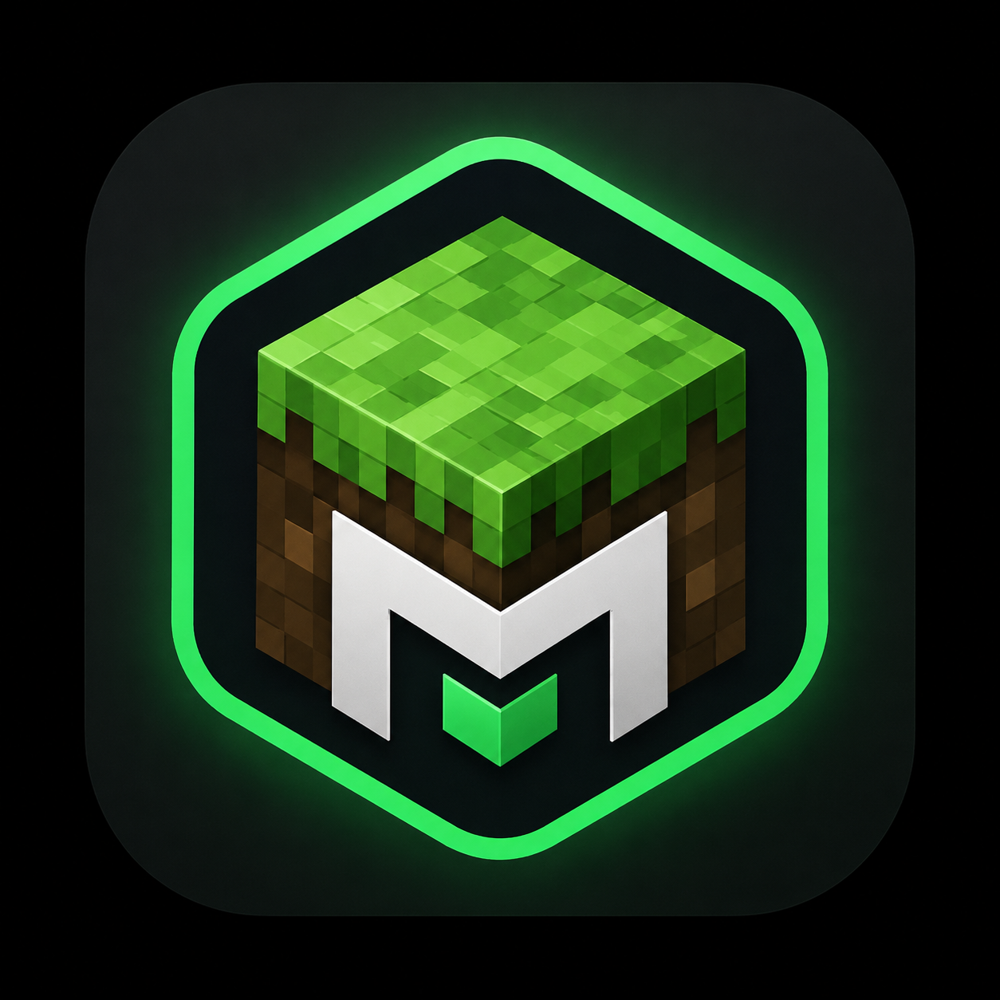

# DuckyLauncher

<div align="center">



# DuckyLauncher

### Un launcher Minecraft moderne, rapide et personnalisable.

Inspiré par l'expérience utilisateur de Modrinth, DuckyLauncher permet de gérer facilement vos instances Minecraft, mods, shaders, resource packs et versions du jeu dans une interface simple et performante.


</div>

---

# ✨ Fonctionnalités

## 🎮 Gestion des instances

- Création d'instances Minecraft
- Modification des instances
- Suppression des instances
- Duplication d'instances
- Organisation par dossiers
- Import / Export

---

## 📦 Gestion des mods

- Installation de mods
- Suppression de mods
- Activation / Désactivation
- Glisser-déposer
- Recherche rapide
- Compatibilité Fabric, Forge, NeoForge et Quilt

---

## 🎨 Resource Packs & Shaders

- Installation en un clic
- Gestion des shaders
- Gestion des resource packs
- Activation / Désactivation

---

## ⚙️ Versions Minecraft

Compatible avec :

- Vanilla
- Fabric
- Forge
- NeoForge
- Quilt

Toutes les versions officielles sont disponibles.

---

## 👤 Comptes Minecraft

- Connexion Microsoft
- Comptes hors ligne (Offline)
- Multi-comptes
- Changement de compte instantané

---

## 🚀 Performances

- Téléchargements rapides
- Faible consommation mémoire
- Interface fluide
- Lancement rapide des jeux
- Optimisé pour Windows

---

## 🛠 Paramètres

- Choix de la mémoire RAM
- Sélection du Java
- Arguments JVM
- Dossier du jeu personnalisable
- Thème clair / sombre
- Langues multiples

---

# 📥 Installation

Téléchargez la dernière version depuis la page **Releases**.

Lancez simplement :

```
DuckyLauncher.exe
```

L'application installera automatiquement les composants nécessaires lors du premier lancement.

---

# 📂 Structure

```
DuckyLauncher/
│
├── instances/
├── assets/
├── libraries/
├── runtime/
├── downloads/
├── logs/
├── settings.json
└── DuckyLauncher.exe
```

---

# 💻 Configuration minimale

| Composant | Minimum |
|------------|----------|
| OS | Windows 10/11 |
| RAM | 4 Go |
| Java | Installé automatiquement |
| Internet | Recommandé |

---

# 📷 Aperçu

Ajoutez ici des captures d'écran du launcher.

---

# ❤️ Remerciements

Merci à tous les testeurs et à la communauté Minecraft.

---

# 📜 Licence

Ce projet est distribué sous licence **MIT**.

---

<div align="center">

### DuckyLauncher

Le launcher Minecraft moderne, rapide et personnalisable.

</div>